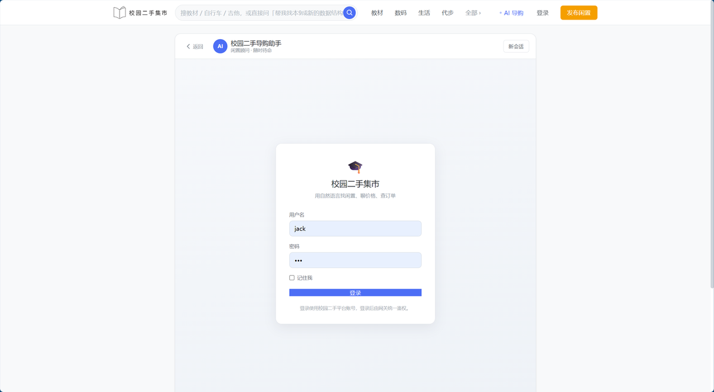
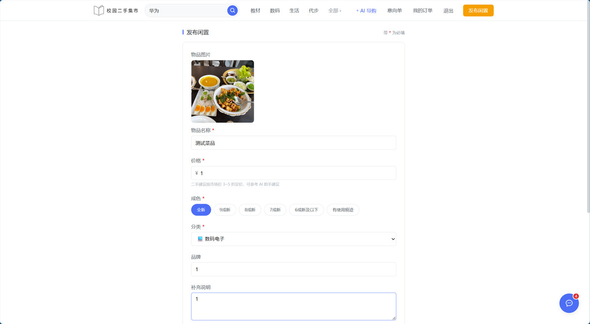
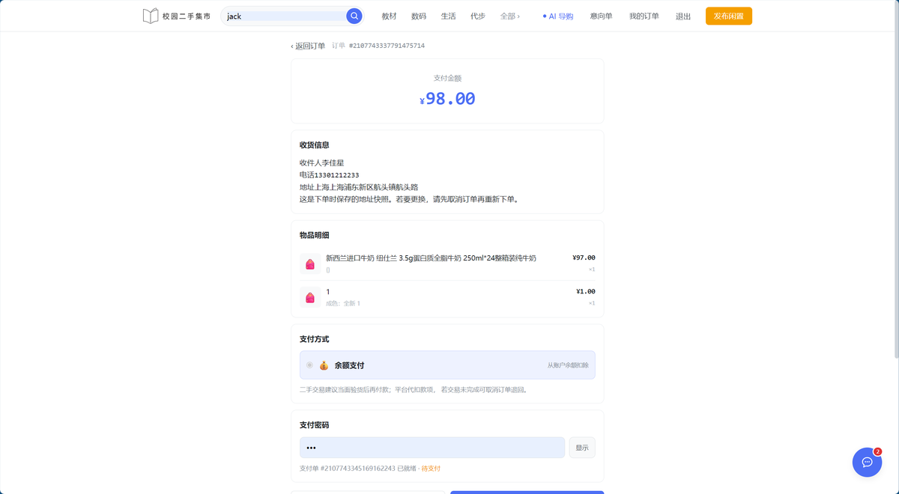
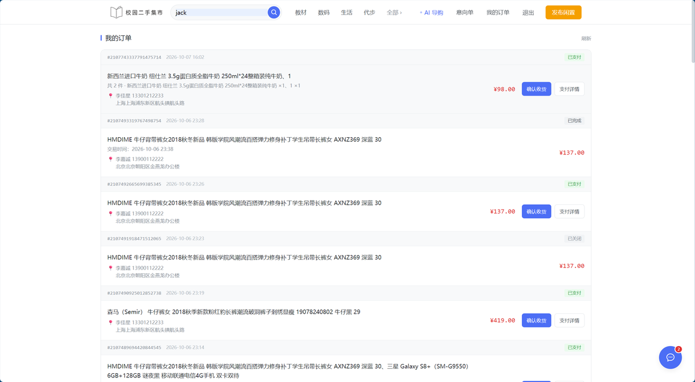
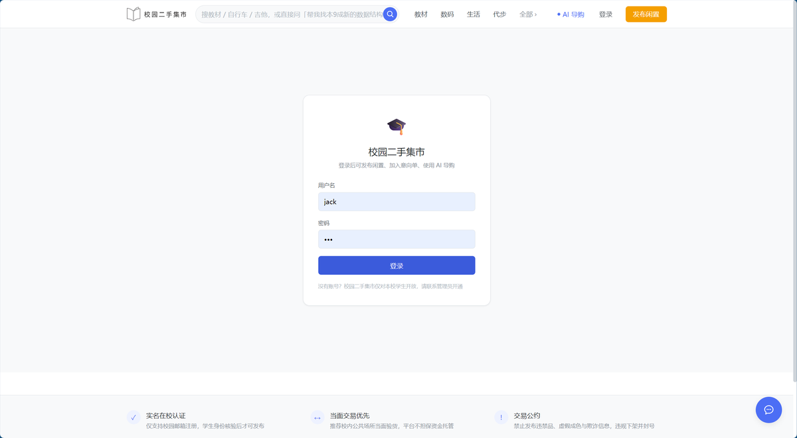

# 校园二手集市 · 后端微服务

Spring Cloud 微服务架构的校园二手交易平台后端，包含一个基于 **ReAct 模式的 AI Agent** 模块。

> 前端仓库：[Vue](https://github.com/songzhihangdev/Campus-Secondhand-Market-Vue)（独立仓库）

---

## 目录

- [界面展示](#界面展示)
- [技术栈](#技术栈)
- [模块清单与端口](#模块清单与端口)
- [快速启动](#快速启动)
- [配置详解（改哪个文件）](#配置详解改哪个文件)
- [Nacos 配置导入](#nacos-配置导入)
- [数据库初始化](#数据库初始化)
- [JWT 密钥库生成](#jwt-密钥库生成)
- [图片存储配置](#图片存储配置)
- [接口一览](#接口一览)
- [常见问题排查](#常见问题排查)

---

## 界面展示

### AI Agent（ReAct 智能体）

| | |
|---|---|
| **侧边抽屉入口**<br>悬浮球打开对话面板，不打断浏览 | **登录鉴权**<br>Agent 复用商城 JWT，与主站同一套身份 |
|  |  |

| | |
|---|---|
| **多轮对话 + 工具调用**<br>展示「思考 → 调用技能 → 观察结果」全过程 | **商品推荐**<br>Agent 主动推荐并给出理由 |
|  |  |

### 商品与交易

| | |
|---|---|
| **商品搜索**<br>ES 全文检索，支持品牌/分类/价格筛选 | **商品详情**<br>商品详情页展示 |
|  |  |

| | |
|---|---|
| **发布闲置**<br>支持图片上传 | **发布成功**<br>写入 MySQL 并同步 ES 索引 |
|  |  |

| | |
|---|---|
| **意向单**<br>多件商品合并下单，选址一次 | **提交订单**<br>下单即写入地址快照 |
|  |  |

| | |
|---|---|
| **我的订单**<br>按状态分组，操作内联 | **订单详情**<br>淘宝式：支付方式/时间/商品图 |
|  |  |

| | |
|---|---|
| **登录页** | **商品售罄标注** |
|  |  |

---

## 技术栈

| 分类 | 组件 | 版本 |
|---|---|---|
| 基础框架 | Spring Boot | 2.7.12 |
| 微服务 | Spring Cloud | 2021.0.3 |
| 微服务 | Spring Cloud Alibaba | 2021.0.4.0 |
| ORM | MyBatis-Plus | 3.5.3.1 |
| 数据库 | MySQL | 8.0.23 |
| 搜索 | Elasticsearch | 7.12.1 |
| 缓存/工具 | Hutool | 5.8.11 |
| 服务发现/配置 | Nacos | — |
| 消息队列 | RabbitMQ | — |
| 声明式调用 | OpenFeign | — |
| 代码简化 | Lombok | 1.18.20 |
| AI | DeepSeek API（deepseek-chat） | — |

**环境要求**

| 项 | 版本 | 说明 |
|---|---|---|
| JDK | **17** | Lombok 1.18.20 在 JDK 21+ 下注解会失效，务必用 17 |
| Maven | 3.9+ | — |
| MySQL | 8.0 | 需手动建库（见 [数据库初始化](#数据库初始化)） |
| Redis | 5+ | seckill 模块依赖（未实现） |
| RabbitMQ | 3.8+ | 延迟关单、ES 库存同步依赖 |
| Elasticsearch | 7.12.1 | **版本必须一致**，高版本客户端不兼容低版本服务端 |
| Nacos | 2.x | 服务发现 + 配置中心 |

---

## 模块清单与端口

| 模块 | 端口 | 服务名 |职责 |
|---|---|---|---|
| `campus-gateway` | 8080 | `gateway` | API 网关，路由转发 + JWT 鉴权 |
| `campus-user` | 8085 | `campus-user` | 用户注册/登录、收货地址 |
| `campus-item` | 8081 | `campus-item` | 商品管理、图片上传、ES 搜索 |
| `campus-cart` | 8082 | `campus-cart` | 意向单（购物车） |
| `campus-trade` | 8084 | `campus-trade` | 订单、支付后回调、MQ 延迟关单 |
| `campus-pay` | 8083 | `campus-pay` | 支付单、余额支付 |
| `campus-agent` | 8090 | `campus-agent` | **ReAct AI Agent**（对话 + 工具调用） |
| `campus-seckill`（未实现） | 8092 | `campus-seckill` | 秒杀（Redis 预扣减） |
| `campus-common` | — | — | 公共能力：异常处理、工具类、拦截器 |
| `campus-api` | — | — | 服务间Feign 接口定义（无业务代码） |

---

## 快速启动

### 1. 准备中间件

确保MySQL、Redis、RabbitMQ、Elasticsearch、Nacos 已启动。

### 2. 初始化数据库

```bash
mysql -uroot -p < sql/campus-item.sql
mysql -uroot -p < sql/campus-user.sql
mysql -uroot -p < sql/campus-cart.sql
mysql -uroot -p < sql/campus-trade.sql
mysql -uroot -p < sql/campus-pay.sql
```

详见 [数据库初始化](#数据库初始化)。

### 3. 导入 Nacos 配置

登录 Nacos（默认 `8848`），按 [Nacos 配置导入](#nacos-配置导入) 导入 `nacos/` 目录下的 4 个配置。

> ⚠️ **`gateway-routes.json` 必须导入**，否则网关无法路由，所有接口返回 503。

### 4. 生成 JWT 密钥库

见 [JWT 密钥库生成](#jwt-密钥库生成)。

### 5. 修改数据库连接

5 个业务服务的 `application-local.yaml` 里配置了数据库地址，逐个改成你自己的：

```yaml
hm:
  db:
    host: 192.168.1.4   # 改成你的 MySQL 地址
    pw: 123# 改成你的密码
```

**批量修改的文件（5 个）**：
- `campus-item/src/main/resources/application-local.yaml`
- `campus-user/src/main/resources/application-local.yaml`
- `campus-cart/src/main/resources/application-local.yaml`
- `campus-trade/src/main/resources/application-local.yaml`
- `campus-pay/src/main/resources/application-local.yaml`

同时修改 `application.yaml` 里的 `hm.db.host` / `hm.db.pw`（公共默认值）。

### 6. 编译打包

```bash
mvn clean install -DskipTests
```

### 7. 按依赖顺序启动

```
① campus-user    （用户服务，其他服务的 Feign 依赖它）
② campus-item    （商品服务，ES 同步依赖它）
③ campus-trade   （订单服务）
④ campus-pay     （支付服务）
⑤ campus-agent   （AI Agent）
⑥ campus-gateway （网关，最后启动）
```

每服务独立启动：

```bash
cd campus-user
mvn spring-boot:run -Dspring-boot.run.arguments=--server.port=8085
```

### 8. 验证

**在线接口文档**（网关聚合了全部 7 个服务）

```
http://localhost:8080:58900/doc.html
```

> ⚠️ 注意端口是 **58900**（网关的 knife4j 独立端口，见
> `campus-gateway/src/main/resources/application.yaml` 的 `knife4j.port`），
> **不是网关端口 8080** —— 因为 `enable-aggregation: true`，
> 文档服务单独监听。

**单个服务文档**（需直连对应端口，网关不代理）

| 服务 | 地址 |
|---|---|
| 用户 | http://localhost:8085/doc.html |
| 商品 | http://localhost:8081/doc.html |
| 意向单 | http://localhost:8082/doc.html |
| 订单 | http://localhost:8084/doc.html |
| 支付 | http://localhost:8083/doc.html |
| Agent | http://localhost:8090/doc.html |
| 秒杀 | http://localhost:8092/doc.html |

**功能自测**：登录 → 搜索商品 → 发布闲置（带图）→ 下单支付 → 确认收货 → 用 AI 问「推荐点便宜的耳机」

**预置演示账号**（由 `sql/campus-user.sql` 插入，密码均为 `123`）

| id | 用户名 | 说明 |
|---|---|---|
| 1 | `Jack` | 主账号，地址/订单数据均属此账号 |
| 2 | `Rose` | |
| 3 | `Hope` | |
| 4 | `Thomas` | |

> 密码在库里是 BCrypt 哈希（`$2a$10$...`），无法反查明文；
> 已知全部为 `123`。**系统无注册接口**，需要新账号时改 SQL 脚本。

---

## 配置详解（改哪个文件）

### 关键：三个配置文件的优先级

Spring Boot 的 `application-{profile}.yaml` **优先级高于** `application.yaml`，后者是公共默认值。

**因此：环境相关的值（IP、密码）改 profile 文件，全局共用的值改 application.yaml。**

各模块用到的 profile：

| 模块 | 生效的 profile | 配置文件 |
|---|---|---|
| campus-item | local | `application-local.yaml` |
| campus-user | local | `application-local.yaml` |
| campus-trade | local | `application-local.yaml` |
| campus-pay | local | `application-local.yaml` |
| campus-seckill | local | `application-local.yaml` |
| campus-cart | dev（bootstrap）/ local（application） | `bootstrap.yaml` + `application-local.yaml` |
| campus-gateway | dev | `bootstrap.yaml` |
| campus-agent | 无（用 yml） | `application.yml` |

> ⚠️ **cart 和 gateway 的 profile 是 `dev`**，与其他服务不同，
> 改它们的配置要去 `bootstrap.yaml` 而非 `application-local.yaml`。

---

### 数据库配置

**位置**（优先级从高到低）

| 文件 | 影响的模块 | 键名 |
|---|---|---|
| `campus-{服务}/src/main/resources/application-local.yaml` | 各业务服务 | `hm.db.host` / `hm.db.pw` |
| `campus-{服务}/src/main/resources/application.yaml` | 各业务服务 | `hm.db.host` / `hm.db.port` / `hm.db.database` / `hm.db.un` / `hm.db.pw` |
| Nacos `shared-jdbc.yaml` | `campus-cart`（通过 shared-configs 引入） | `hm.db.*` |

**各服务的库名**

| 服务 | 库名 |
|---|---|
| campus-item | `campus-item` |
| campus-user | `campus-user` |
| campus-cart | `campus-cart` |
| campus-trade | `campus-trade` |
| campus-pay | `campus-pay` |

示例（`campus-item/src/main/resources/application-local.yaml`）：

```yaml
hm:
  db:
    host: 192.168.1.4# 你的MySQL 地址
    pw: 123           # 你的密码
```

---

### Nacos 地址配置

**位置**

| 文件 | 模块 |
|---|---|
| `campus-{服务}/src/main/resources/application.yaml` | item / user / cart / trade / pay / seckill |
| `campus-{服务}/src/main/resources/bootstrap.yaml` | cart / gateway |
| `campus-agent/src/main/resources/application.yml` | agent |

```yaml
spring:
  cloud:
    nacos:
      server-addr: 192.168.1.4:8848      # Nacos 地址
      discovery:
        server-addr: 192.168.1.4:8848# 服务注册地址
```

**注意**：地址未配置时，服务能启动但**不注册到 Nacos**，
网关按 `lb://服务名` 转发时返回 **503**。表现为"端口监听正常但接口全挂"。

---

### JWT 与密钥库配置

**位置**

| 文件 | 模块 |
|---|---|
| `campus-gateway/src/main/resources/application.yaml` | 网关验签 |
| `campus-user/src/main/resources/application.yaml` | 登录签发 |
| `campus-agent/src/main/resources/application.yml` | Agent 验签 |

```yaml
jwt:
  location: classpath:hmall.jks
  alias: hmall
  password: hmall123
  tokenTTL: 30m
```

**三处配置必须一致**（同一个密钥库、同一别名密码），
否则网关验签失败，所有需登录的接口返回 401。

---

### 网关鉴权白名单

**位置**：`campus-gateway/src/main/resources/application.yaml`

```yaml
auth:
  excludePaths:
    - /items/image/**    # 图片上传接口
    - /itemImage/**      # 图片静态访问（ 标签不带 Authorization 头，必须放行）
    - /search/**         # 搜索公开
    - /users/login       # 登录
    - /items/page        # 商品列表（只读）
    - /items/*           # 商品详情
    - /doc.html
    - /webjars/**
    - /hi
```

> ⚠️ 新增免鉴权路径必须加到这里，否则前端会被 401 拦掉。
>
> **图片有两个路径，别混淆**：
> | 用途 | 路径 | 说明 |
> |---|---|---|
> | **上传** | `POST /items/image` | 需鉴权，在 `excludePaths` 里放行 |
> | **访问** | `GET /itemImage/{日期}/{文件名}` | 免鉴权，浏览器 `` 直接请求 |
>
> 两者都需要 `nacos/gateway-routes.json` 里有对应路由。

---

### 图片上传配置

**位置**：`campus-item/src/main/resources/application.yaml`

```yaml
hm:
  image:
    root-dir: D:/JavaProject/261005/itemImage  # 绝对路径，按天分子目录
    max-size: 5242880                          # 单张上限 5MB
spring:
  servlet:
    multipart:
      max-file-size: 6MB    # 容器层上限，须 ≥ hm.image.max-size
      max-request-size: 8MB
```

**换机器只需改 `root-dir` 一处**，上传（落盘）与访问（映射）共用这个值。

访问路径由 `campus-item/src/main/java/com/campus/item/config/ImageResourceConfig.java`
把 `/itemImage/**` 映射到该目录产生，与上传路径是两个不同 URL。

**必须绝对路径**：相对路径会随进程工作目录漂移，
表现为「上传成功但图片 404」。

Linux 写法：`root-dir: /data/hmall/itemImage`

存储结构：

```
itemImage/
  └─ 2026-10-07/              # 按天分目录
       └─ 1791348741554_a0e38c03.png
```

---

### AI Agent 配置

**位置**：`campus-agent/src/main/resources/application.yml`

```yaml
server:
  port: 8090
spring:
  application:
    name: campus-agent
  cloud:
    nacos:
      server-addr: 192.168.1.4:8848

agent:
  max-round: 10                    # ReAct 最大循环轮次

  jwt:                             # 与商城共用同一密钥库
    location: classpath:hmall.jks
    alias: hmall
    password: hmall123
    tokenTTL: 30m

  session:
    root-dir: D:/JavaProject/261005/UserContext  # 对话记录落盘目录
    memory-ttl: 2h                # 内存热缓存时长

  compress:                        # 上下文压缩（防token 超限）
    enabled: true
    max-items-in-list: 5# 商品列表类observation 只留前 5 条
    max-plain-text-length: 1000
    max-observation-length: 1500
    max-messages: 60               # 消息数超阈值时按整轮丢弃最早消息
    keep-recent-messages: 20

  skills:                          # 技能定义（函数调用）
    llm-def: skills/llm_skill_def.json    # 技能名 + 参数 JSON-Schema
    http-meta: skills/http_meta.json      # 技能对应的 HTTP 调用信息

  model: deepseek-chat
  timeout: 30000
```

**API Key 配置**（环境变量，不入库）

```bash
export LLM_API_KEY=sk-xxxxxx
```

**技能文件**（新增技能要同时改两个文件，名称必须一致）

| 文件 | 位置 | 内容 |
|---|---|---|
| 技能定义 | `campus-agent/src/main/resources/skills/llm_skill_def.json` | `name` / `description` / `parameters` |
| HTTP 元数据 | `campus-agent/src/main/resources/skills/http_meta.json` | `skillName` / `httpMethod` / `path` / `pathParams` |

> ⚠️ `parameters` 必须是 **JSON-Schema 对象**（`type`/`properties`/`required`），
> 不能写成数组 —— 格式错误时本地不报错，只有调用 LLM 时才被服务端 400 拒绝。

---

### RabbitMQ 队列

| 交换机 / 队列 | 定义位置（注解在代码里） | 用途 |
|---|---|---|
| `trade.delay.direct` → `trade.delay.order.queue` | `campus-trade/.../listener/OrderDelayMessageListener.java` | 订单超时未支付 → 自动关单 |
| `pay.direct` | `campus-pay/.../service/impl/PayOrderServiceImpl.java` | 支付成功 → 通知 trade 改订单状态 |
| `item.direct`（routing key `stock.change`） | `campus-item/.../listener/StockChangeListener.java` | 库存变化 → 同步 ES |

> 队列名写在 `@RabbitListener` 注解里（`campus-{服务}/src/main/java/.../listener/`），
> 不是在 yaml 里配。改队列名要改代码并重启消费者。

---

### 日志配置

**位置**：`campus-{服务}/src/main/resources/application.yaml`

```yaml
logging:
  level:
    com.campus: info                # 业务日志 info（改 debug 会刷爆磁盘）
    com.campus.{服务}.mapper: debug # SQL 临时开debug
  pattern:
    dateformat: HH:mm:ss:SSS
  file:
    path: "logs/${spring.application.name}"
```

日志落在 `campus-{服务}/logs/campus-{服务}/`（已被 `.gitignore` 排除）。

---

## Nacos 配置导入

登录 Nacos 控制台 → **配置管理 / 配置列表** → **导入配置**，选择 `nacos/` 目录下的文件。

| 文件 | dataId | group | 说明 |
|---|---|---|---|
| `gateway-routes.json` | `gateway-routes.json` | `DEFAULT_GROUP` | **网关路由表，必导** |
| `shared-log.yaml` | `shared-log.yaml` | `DEFAULT_GROUP` | 日志级别共享配置 |
| `shared-swagger.yaml` | `shared-swagger.yaml` | `DEFAULT_GROUP` | 文档开关共享配置 |
| `cart-service.yaml` | `cart-service.yaml` | `DEFAULT_GROUP` | 购物车专属配置 |

**导入后必须确认网关路由已生效**（10 条）：

| 路由 ID | 目标服务 | 路径 |
|---|---|---|
| `campus-user-users` | campus-user | `/users/**` |
| `campus-user-addresses` | campus-user | `/addresses/**` |
| `campus-item-image` | campus-item | `/itemImage/**` |
| `campus-item` | campus-item | `/items/**` |
| `campus-cart` | campus-cart | `/carts/**` |
| `campus-trade` | campus-trade | `/orders/**` |
| `campus-pay` | campus-pay | `/pay-orders/**` |
| `campus-agent` | campus-agent | `/agent/**` |
| `campus-seckill` | campus-seckill | `/seckill/**` |
| `campus-search` | campus-item | `/search/**` |

> ⚠️ 路由配置在 Nacos，**修改后需重启网关**才生效
> （或确认 Nacos 监听已开启）。漏配路由 → 访问该路径返回 503 或 404。

---

## 数据库初始化

`sql/` 目录提供建库建表脚本，按顺序执行：

```bash
# 方式一：命令行
mysql -uroot -p < sql/campus-item.sql
mysql -uroot -p < sql/campus-user.sql
mysql -uroot -p < sql/campus-cart.sql
mysql -uroot -p < sql/campus-trade.sql
mysql -uroot -p < sql/campus-pay.sql
```

|脚本 | 库名 | 说明 |
|---|---|---|
| `sql/campus-item.sql` | `hm-item` | 商品、订单明细快照 |
| `sql/campus-user.sql` | `hm-user` | 用户、收货地址 |
| `sql/campus-cart.sql` | `hm-cart` | 意向单 |
| `sql/campus-trade.sql` | `hm-trade` | 订单、订单明细、物流快照 |
| `sql/campus-pay.sql` | `hm-pay` | 支付单 |
| `sql/nacos.sql` | `nacos` | Nacos 自身的库（**非业务库**，已装好 Nacos 则无需执行） |

**表结构要点**

| 表 | 用途 |
|---|---|
| `item` | 商品。`status`：0=已售 1=在售 2=下架 |
| `order` | 订单。`status`：1待支付 2已支付 3交易中 4已完成 5已关闭 |
| `order_detail` | 订单明细（下单时的商品快照，含 `image`） |
| `order_logistics` | **地址快照**（下单时从 user 服务抓取写入） |
| `pay_order` | 支付单。`status`：1待支付 2已关闭 3支付成功 |
| `user` | 用户。`balance` 单位为**分** |
| `address` | 收货地址 |
| `cart` | 意向单 |

> 金额单位统一为**分**，避免浮点精度问题。

---

## JWT 密钥库生成

项目需要 `hmall.jks` 密钥库（JWT RS256 签名）。**该文件已从仓库移除**，需自行生成：

```bash
# 在任意目录执行，生成后复制到以下 3 个位置
keytool -genkeypair -alias hmall -keyalg RSA -keypass hmall123 \
        -keystore hmall.jks -storepass hmall123 -keysize 2048 -validity 36500
```

**复制到 3 个模块的 `src/main/resources/`：**

| 目标路径 | 用途 |
|---|---|
| `campus-user/src/main/resources/hmall.jks` | 登录时签发 token |
| `campus-gateway/src/main/resources/hmall.jks` | 网关验签 |
| `campus-agent/src/main/resources/hmall.jks` | Agent 验签 |

> ⚠️ **三处必须是同一个文件**。不一致会导致 401。
> ⚠️ **不要提交到 GitHub**（`.gitignore` 已含 `*.jks`）。
> 泄露后任何人可伪造任意用户的 token 登录。

---

## 图片存储配置

见 [图片上传配置](#图片上传配置)。

```
itemImage/
  └─ 2026-10-07/
       └─ 1791348741554_a0e38c03.png
```

命名规则：`{毫秒时间戳}_{8位随机}.{扩展名}`
- 时间戳前缀 → 天然按时间有序
- 随机后缀 → 同毫秒并发不撞名
- 不用原始文件名 → 防中文/特殊字符/路径穿越

---

## 接口一览

所有接口经网关 `http://localhost:8080` 访问，需 `Authorization: <token>` 头。

### 用户 `campus-user`

| 方法 | 路径 | 说明 | 鉴权 |
|---|---|---|---|
| POST | `/users/login` | 登录，返回 token | 否 |
| PUT | `/users/money/deduct?pw=&amount=` | 扣减余额（参数在 query） | 是 |
| GET | `/addresses` | 我的地址列表 | 是 |
| GET | `/addresses/{addressId}` | 地址详情 | 是 |

>⚠️ 用户服务**只有登录接口，没有独立注册接口** ——
> 测试账号由 `sql/campus-user.sql` 直接插入。

### 商品 `campus-item`

| 方法 | 路径 | 说明 | 鉴权 |
|---|---|---|---|
| GET | `/items/page` | 分页查询 | 否 |
| GET | `/items/{id}` | 商品详情 | 否 |
| POST | `/items` | **发布闲置**（同步写 ES） | 是 |
| PUT | `/items` | 修改闲置 | 是 |
| PUT | `/items/status/{id}/{status}` | 上/下架 | 是 |
| DELETE | `/items/{id}` | 删除 | 是 |
| POST | `/items/image` | **上传图片**（multipart，字段名 `file`）→ 返回 `/itemImage/日期/文件名` | 是 |
| PUT | `/items/sold/{id}` | 标记已售（下架） | 是 |
| GET | `/search/list` | **ES 全文检索** | 否 |

### 意向单 `campus-cart` · 订单 `campus-trade` · 支付 `campus-pay`

| 方法 | 路径 | 说明 |
|---|---|---|
| GET/POST/PUT/DELETE | `/carts/**` | 意向单增删改查 |
| GET/POST/PUT | `/orders/**` | 订单查询、创建 |
| PUT | `/orders/{id}/cancel` | 取消订单（仅待支付） |
| PUT | `/orders/{id}/confirm` | **确认收货**（2 已支付 → 4 已完成） |
| GET | `/pay-orders` | 支付单列表 |
| POST | `/pay-orders` | 创建支付单（返回支付单 id） |
| POST | `/pay-orders/{id}` | 余额支付（`{pw}` 校验支付密码） |
| GET | `/pay-orders/biz/{id}` | 按业务单号查支付单 |

### 秒杀 `campus-seckill`

| 方法 | 路径 | 说明 |
|---|---|---|
| GET | `/seckill/sessions` | 当前秒杀场次 |
| GET | `/seckill/{seckillId}` | 秒杀详情 |
| POST | `/seckill/{seckillId}/do` | 执行秒杀 |

### AI Agent `campus-agent`

| 方法 | 路径 | 说明 |
|---|---|---|
| POST | `/agent/sessions` | 创建会话 |
| GET | `/agent/sessions/{sid}/history` | 拉取历史对话 |
| POST | `/agent/sessions/{sid}/messages` | 发送消息（ReAct 执行） |
| DELETE | `/agent/sessions/{sid}` | 删除会话 |
| GET | `/agent/health` | 健康检查 |

---

## 常见问题排查

| 现象 | 原因 | 解决 |
|---|---|---|
| 网关所有接口 **503** | Nacos 未连上，服务未注册 | 检查 `server-addr`；确认 Nacos 已启动；**先启业务服务再启网关** |
| 需登录接口 **401** | token 无效 / 密钥库不一致 | 确认 3 处 `hmall.jks` 是同一文件；`password` 是否一致 |
| 图片上传成功但**加载 404** | 网关缺路由或缺白名单 | Nacos 导入 `gateway-routes.json`；`application.yaml` 的 `excludePaths` 加 `/itemImage/**` |
| 发布的商品**搜不到** | ES 未同步 | 查 `campus-item` 日志是否有 `ES 同步失败`；ES 版本须为 7.12.1 |
| 删除商品返回 **401** | 已知的鉴权问题 | 待修复（不影响其他接口） |
| 订单支付失败 **NPE** | 前端拿到的 id 精度丢失 | 后端已修（Long 序列化成字符串）；检查网关缓存 |
| Lombok 注解失效 | JDK 版本过高 | **必须用 JDK 17** |
| ES 启动报 `mapper_parsing_exception` | 时间格式与 mapping 不符 | `updateTime` 须为 **long 毫秒时间戳** |
| 启动报 `Could not resolve placeholder` | 配置缺失 | 检查对应 `application*.yaml` |
| MySQL 报 `UnknownHostException: mysql` | 用了 Docker 编排的配置 | 改用 `application-local.yaml` 里的真实地址 |

---

## 开发与测试

```bash
# 编译
mvn clean install -DskipTests

# 跑全部测试（103 个）
mvn test

# 只跑某个模块
mvn -pl campus-trade test
```

---

## License

见 [LICENSE.txt](LICENSE.txt)